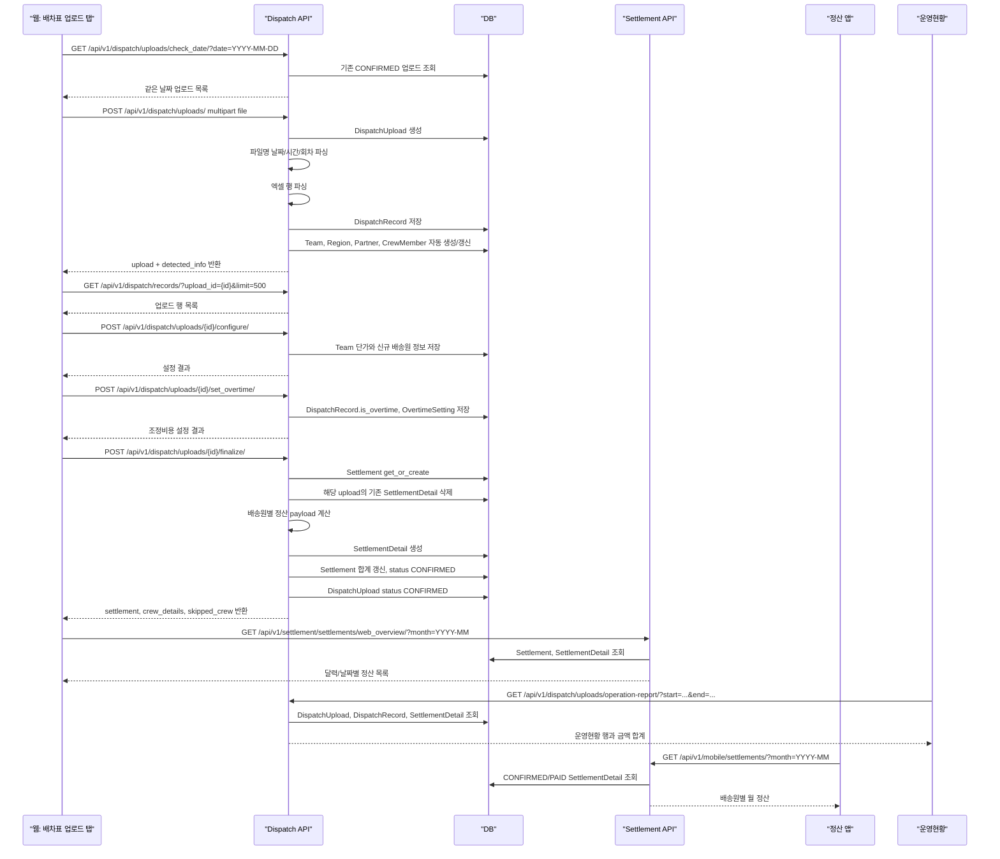

# 배차표 업로드에서 정산처리 반영까지의 전체 흐름

작성 기준: 2026-05-19 현재 코드 기준

이 문서는 웹의 배차표 업로드 탭에서 엑셀 배차표를 올렸을 때, 그 데이터가 `DispatchUpload`, `DispatchRecord`, `Settlement`, `SettlementDetail`로 저장되고 정산관리/운영현황/정산 앱에 반영되는 과정을 정리한 문서다.

## 핵심 요약

현재 실제 운영 플로우는 배차표 업로드 화면에서 다음 순서로 진행된다.

1. 엑셀 파일 업로드
2. 파일명에서 날짜/시간/회차 추출
3. 엑셀 행을 `DispatchRecord`로 저장
4. 조, 권역, 배송원을 자동 감지하고 필요한 기본 데이터를 생성
5. 신규 배송원 및 조 단가 설정
6. 조정비용 설정
7. `finalize` 호출로 정산 생성
8. `Settlement`와 `SettlementDetail`이 생성 또는 갱신
9. 정산관리, 운영현황, 정산 앱, 정산문의가 같은 정산 상세 데이터를 읽음

중요한 점은 현재 정산 생성의 메인 경로가 `POST /api/v1/dispatch/uploads/{id}/finalize/`라는 것이다. `POST /api/v1/settlement/settlements/generate/`도 남아 있지만, 현재 배차표 업로드 화면의 주 플로우는 이 엔드포인트를 쓰지 않는다.

## 화주사별 업로드 로직 독립 원칙

화주사별 배차표 업로드 로직은 독립적으로 개발하고 배포한다.

- 컬리 Excel 업로드는 컬리 전용 파서만 사용한다.
- 쿠팡 텍스트 붙여넣기 업로드는 쿠팡 전용 파서만 사용한다.
- 오네 또는 새 화주사는 기존 컬리/쿠팡 파서를 재사용하지 않는다.
- 새 화주사가 추가되어도 회사관리에서 체크하는 것만으로 업로드가 열리면 안 된다.
- 새 화주사는 별도 입력 UI, 파싱 함수, 저장 매핑, 테스트를 추가한 뒤 지원 목록에 명시적으로 등록해야 한다.
- 화주사별 특수 정산 규칙은 해당 화주사 코드에서만 작동해야 하며, 다른 화주사에 영향을 주면 안 된다.

현재 지원 목록:

| 화주사 | 입력 방식 | 지원 상태 |
| --- | --- | --- |
| `kurly` | Excel 파일 | 지원 |
| `coupang` | 텍스트 붙여넣기 | 지원 |
| `one` | 별도 개발 필요 | 업로드 미지원, 오네 전용 기준 박스수 정산 규칙만 지원 |

## 주요 데이터 모델

| 모델 | 역할 | 주요 필드 |
| --- | --- | --- |
| `DispatchUpload` | 업로드된 배차표 파일 1개 | `file`, `original_filename`, `source_date`, `dispatch_time`, `dispatch_date`, `round_no`, `team`, `status` |
| `DispatchRecord` | 배차표 엑셀의 개별 행 | `manager_name`, `sub_region`, `detail_region`, `households`, `boxes`, `is_yongcha`, `is_overtime`, `is_valid` |
| `Team` | 조 정보와 조 단가 | `receive_price`, `pay_price`, `default_overtime_cost`, 용차 회차별 기본 단가 필드 |
| `CrewMember` | 배송원 정보 | `code`, `name`, `team`, `pay_price`, `yongcha_pay_price`, `is_new`, `is_yongcha`, 회차별 용차/고정급 필드 |
| `OvertimeSetting` | 업로드별 배송원 조정비용 | `dispatch_upload`, `crew_member`, `is_overtime`, `overtime_cost` |
| `YongchaPayGroup` | 용차 팀단가 규칙 | 회차별 `base_pay`, `base_households`, `extra_household_pay` |
| `Settlement` | 조별/일자별 정산 헤더 | `team`, `period_start`, `period_end`, `status`, `total_receive`, `total_pay`, `total_overtime`, `total_profit` |
| `SettlementDetail` | 정산 상세 행 | `settlement`, `dispatch_upload`, `crew_member`, `is_yongcha`, `region`, `boxes`, `receive_amount`, `pay_amount`, `overtime_cost`, `profit` |

## 전체 시퀀스



## 1. 업로드 전 중복 날짜 확인

프론트 파일:

- `frontend/src/views/DispatchView.vue`

API:

- `GET /api/v1/dispatch/uploads/check_date/?date=YYYY-MM-DD`

동작:

1. 프론트가 파일명에서 `YYYY-MM-DD` 형식의 날짜를 먼저 찾는다.
2. 해당 날짜로 기존 확정 업로드가 있는지 조회한다.
3. 백엔드는 `DispatchUpload.status = CONFIRMED`인 업로드 중 `dispatch_date` 또는 `source_date`가 같은 데이터를 반환한다.
4. 이미 있으면 프론트에서 "추가로 올릴지" 확인한다.
5. 사용자가 동의하면 같은 날짜/조 정산에 새 업로드의 정산 상세가 합산될 수 있다.

주의:

- 같은 날짜에 여러 배차표를 올리는 것이 막히지는 않는다.
- 이후 `finalize` 단계에서 같은 `team + date`의 `Settlement` 하나에 여러 업로드의 `SettlementDetail`이 같이 들어간다.

## 2. 엑셀 업로드

프론트 API 함수:

- `frontend/src/api/dispatch.js`
- `uploadDispatchFile(file)`

API:

- `POST /api/v1/dispatch/uploads/`
- multipart form-data
- 필드: `file`

백엔드 진입점:

- `backend/apps/dispatch/views.py`
- `DispatchUploadViewSet.create`

처리 순서:

1. `DispatchUploadCreateSerializer`로 파일 요청을 검증한다.
2. 파일명에서 날짜, 시간, 회차를 추출한다.
3. `DispatchUpload`를 `PENDING` 상태로 먼저 생성한다.
4. `_parse_and_save_records(dispatch_upload)`를 호출해 엑셀 내용을 파싱한다.
5. 성공하면 업로드 정보와 `detected_info`를 반환한다.
6. 파싱 중 예외가 나면 업로드 상태를 `ERROR`로 저장한다.

## 3. 파일명 날짜/시간/회차 판정

관련 함수:

- `backend/apps/dispatch/views.py`
- `parse_dispatch_filename_info(filename)`

추출되는 값:

| 값 | 의미 |
| --- | --- |
| `source_date` | 파일명에 적힌 원본 날짜 |
| `dispatch_time` | 파일명에 적힌 배차 시간 |
| `round_no` | 파일명에 적힌 `1차`, `2차`, `3차` 같은 회차 |
| `work_date` | 출근일 기준 내부 계산값 |
| `dispatch_date` | 현재 시스템에서 정산/운영현황에 쓰는 배송일 |

현재 날짜 규칙:

1. 파일명에서 날짜를 찾는다.
2. 파일명에서 시간이 있고 시간이 `15:00` 이전이면 `work_date = source_date - 1일`로 본다.
3. 그렇지 않으면 `work_date = source_date`로 본다.
4. `dispatch_date = to_delivery_date(work_date)`로 저장한다.
5. 현재 `to_delivery_date` 기준으로 배송일은 출근일의 다음날이다.

정리하면, `DispatchUpload.dispatch_date`라는 필드명은 남아 있지만 현재 정산과 운영현황에서는 배송일로 사용된다.

## 4. 엑셀 행 파싱과 DispatchRecord 저장

관련 함수:

- `DispatchUploadViewSet._parse_and_save_records`

엑셀 파싱 방식:

- `openpyxl.load_workbook(file_path)`로 엑셀을 연다.
- 첫 번째 시트를 사용한다.
- 2행부터 실제 데이터로 읽는다.

현재 읽는 컬럼:

| 엑셀 컬럼 index | 의미 | 저장 필드 |
| --- | --- | --- |
| 0 | 배송 유형 | `delivery_type` |
| 1 | 파트너명 | `partner_name` |
| 2 | 담당자명/배송원명 | `manager_name` |
| 3 | 소권역 | `sub_region` |
| 4 | 상세권역 | `detail_region` |
| 5 | 가구수 | `households` |
| 6 | 박스수 | `boxes`, `original_boxes` |

배송원명 정규화:

1. 앞쪽 영문 접두어를 제거한다.
2. 이름 끝에 `V` 또는 `v`가 있으면 용차로 판정한다.
3. 용차 suffix는 제거하고 배송원 코드/이름으로 저장한다.

권역 코드 감지:

- `sub_region`을 쉼표로 분리한다.
- `숫자 + 영문 + 숫자` 형식의 권역 코드만 권역 코드로 본다.
- 권역 코드에서 영문 부분을 조 코드로 추출한다.
  - 예: `70A8`이면 조 코드 `A`

저장 조건:

- `manager_name`이 있거나 `boxes > 0`인 행은 `DispatchRecord`로 저장한다.
- 파싱 실패한 행은 `is_valid = False`와 `error_message`로 저장한다.
- 정상 행은 `is_valid = True`로 저장한다.

## 5. 조, 권역, 배송원 자동 감지와 자동 생성

엑셀 파싱 후 자동으로 처리되는 데이터:

1. 감지된 조 코드로 `Team`을 찾거나 생성한다.
2. 감지된 권역 코드로 `Region`을 찾거나 생성한다.
3. 파트너명이 있으면 `Partner`를 찾거나 생성한다.
4. 배송원명으로 `CrewMember`를 찾거나 생성한다.

배송원 자동 생성 규칙:

| 조건 | 처리 |
| --- | --- |
| 엑셀 이름 끝이 `V/v` | `is_yongcha = True`, `is_new = False` |
| 일반 배송원이고 기존에 없음 | `is_new = True`, `is_yongcha = False` |
| 기존 배송원이 있는데 이번 엑셀에서 용차로 감지 | `is_yongcha = True`, `is_new = False`로 갱신 |
| 업로드에 조가 없고 권역에서 조를 감지 | 첫 번째 감지 조를 `dispatch_upload.team`으로 연결 |

이 단계가 끝나면 업로드 화면은 신규 배송원, 조 단가, 기존 배송원 상태를 보여줄 수 있다.

## 6. 감지 정보 조회

API:

- `GET /api/v1/dispatch/uploads/{id}/detected_info/`

백엔드:

- `DispatchUploadViewSet.detected_info`
- 내부에서 `_get_detected_info(dispatch_upload)` 호출

응답에 포함되는 주요 정보:

| 응답 필드 | 내용 |
| --- | --- |
| `teams` | 감지된 조, 조 ID, 수신 단가, 지급 단가, 기본 조정비용 |
| `regions` | 감지된 권역 코드 목록 |
| `crew_members` | 감지된 배송원, 신규 여부, 용차 여부, 단가, 회차별 용차 여부 |

프론트 사용:

- 신규 배송원 입력 목록 구성
- 조 단가 설정 입력 구성
- 조정비용 설정 대상 구성

## 7. 원본 행 목록 조회

API:

- `GET /api/v1/dispatch/records/?upload_id={id}&limit=500`

백엔드:

- `DispatchRecordViewSet.list`

역할:

- 업로드된 엑셀 행을 프론트에서 다시 확인하기 위해 사용한다.
- 조정비용 대상 배송원 목록을 만들 때도 이 데이터를 참고한다.

## 8. 조 단가와 신규 배송원 설정

프론트 API 함수:

- `configureAll(uploadId, data)`

API:

- `POST /api/v1/dispatch/uploads/{id}/configure/`

요청 구조:

```json
{
  "teams": [
    {
      "id": 1,
      "receive_price": 5000,
      "pay_price": 1500,
      "default_overtime_cost": 30000
    }
  ],
  "crew": [
    {
      "code": "홍길동",
      "name": "홍길동",
      "phone": "",
      "vehicle_number": "",
      "pay_price": 1500,
      "yongcha_pay_price": 3000,
      "is_yongcha": false
    }
  ]
}
```

백엔드 처리:

1. `teams` 배열의 각 조에 대해 `Team.receive_price`, `Team.pay_price`, `Team.default_overtime_cost`를 저장한다.
2. `crew` 배열의 각 배송원에 대해 이름, 연락처, 차량번호, 정규 지급 단가, 용차 지급 단가를 저장한다.
3. 신규 배송원인데 지급 단가가 0원이거나 `is_yongcha = true`면 용차로 처리한다.
4. 저장 후 `_update_mor_summary(dispatch_upload)`로 업로드 요약을 다시 계산한다.

정산에 미치는 영향:

- 조의 `receive_price`는 이후 `finalize`에서 전체 수신액 계산에 사용된다.
- 정규 배송원의 `pay_price`는 정규 지급액 계산에 사용된다.
- 용차 배송원의 `yongcha_pay_price`는 용차 지급액 fallback으로 사용된다.
- `is_new`가 계속 `True`인 정규 배송원은 `finalize`에서 스킵될 수 있다.

## 9. 조정비용 설정

프론트 API 함수:

- `setOvertime(uploadId, crew)`

API:

- `POST /api/v1/dispatch/uploads/{id}/set_overtime/`

요청 구조:

```json
{
  "crew": [
    {
      "name": "홍길동",
      "is_overtime": true,
      "overtime_cost": 30000
    }
  ]
}
```

백엔드 처리:

1. 해당 업로드의 `DispatchRecord.manager_name = name`인 행들의 `is_overtime`을 갱신한다.
2. `CrewMember`를 찾는다.
3. 조정비용이 있으면 `OvertimeSetting`을 생성 또는 갱신한다.
4. 조정비용이 없으면 기존 `OvertimeSetting`을 삭제한다.

정산에 미치는 영향:

- `finalize`에서 배송원별로 `OvertimeSetting`을 조회한다.
- 조정비용은 배송원 정산 payload의 `overtime_cost`가 된다.
- 권역별 상세 행을 만들 때 첫 번째 권역 행에 조정비용이 들어간다.
- `Settlement.total_overtime`과 `Settlement.total_profit`에 반영된다.

## 10. 정산 확정 생성

프론트 API 함수:

- `finalizeUpload(uploadId, data)`

API:

- `POST /api/v1/dispatch/uploads/{id}/finalize/`

백엔드:

- `DispatchUploadViewSet.finalize`

처리 순서:

1. 업로드를 조회한다.
2. `base_date = dispatch_upload.dispatch_date`로 정산 기준일을 정한다.
3. `period_start = base_date`, `period_end = base_date`로 하루짜리 정산을 만든다.
4. 업로드에 조가 없으면 400 응답을 반환한다.
5. 유효한 `DispatchRecord`만 조회한다.
6. 배송원별로 행을 묶는다.
7. 배송원 상태를 보고 정규/용차 여부를 확정한다.
8. `Settlement.objects.get_or_create(team=team, period_start=base_date, period_end=base_date)`로 정산 헤더를 찾거나 만든다.
9. 같은 업로드에서 이미 만들어진 기존 `SettlementDetail`만 삭제한다.
10. 배송원별로 `build_crew_settlement_payload`를 호출해 금액을 계산한다.
11. 권역별로 `SettlementDetail`을 생성한다.
12. 정산 전체 합계를 다시 집계한다.
13. `Settlement.status = CONFIRMED`로 저장한다.
14. `DispatchUpload.status = CONFIRMED`로 저장한다.
15. 업로드 요약을 다시 계산하고 응답을 반환한다.

## 11. finalize에서 배송원별 스킵/자동 처리 규칙

`finalize`는 모든 엑셀 행을 무조건 정산에 넣지 않는다. 배송원 상태에 따라 아래처럼 처리한다.

| 상황 | 처리 |
| --- | --- |
| 배송원명이 비어 있음 | 해당 행 무시 |
| 기존 배송원이 있고 용차로 판정됨 | 필요하면 `is_yongcha = True`, `is_new = False`로 갱신 후 정산 포함 |
| 기존 배송원이 아직 `is_new = True` | `skipped_crew`에 넣고 정산 제외 |
| 배송원이 없지만 엑셀에서 `V/v`로 용차 감지 | 용차 배송원을 자동 생성하고 정산 포함 |
| 배송원이 없고 용차도 아님 | `skipped_crew`에 넣고 정산 제외 |

응답의 `skipped_crew`는 정산에서 제외된 배송원 코드 목록이다.

## 12. 용차 여부 판정 규칙

관련 함수:

- `backend/apps/dispatch/settlement_services.py`
- `is_effective_yongcha(crew_member, round_no, explicit_yongcha)`

우선순위:

1. 엑셀 행에서 명시적으로 용차로 감지된 경우
   - 배송원명 끝 `V/v`
   - `DispatchRecord.is_yongcha = True`
2. 배송원 자체가 용차인 경우
   - `CrewMember.is_yongcha = True`
3. 정규 배송원이지만 해당 회차가 용차로 설정된 경우
   - `round_1_is_yongcha`
   - `round_2_is_yongcha`
   - `round_3_is_yongcha`

하나라도 해당되면 해당 업로드/회차 정산에서는 용차 정산으로 계산된다.

## 13. 정산 금액 산식

관련 함수:

- `build_crew_settlement_payload`
- `resolve_yongcha_pay_price`
- `resolve_regular_fixed_pay`
- `resolve_yongcha_group_pay`
- `build_region_allocations`

### 13.1 전체 수신액

```text
전체 수신액 = Team.receive_price * 배송원의 총 박스수
```

권역별 상세 행에서는:

```text
권역 수신액 = Team.receive_price * 해당 권역 박스수
```

### 13.2 정규 배송원 지급액

기본 산식:

```text
정규 지급액 = CrewMember.pay_price * 총 박스수
```

정규 배송원 회차별 고정급이 있으면:

```text
정규 지급액 = 해당 회차 고정급
```

고정급 필드:

- `regular_round_1_base_pay`
- `regular_round_2_base_pay`
- `regular_round_3_base_pay`

고정급이 적용되면 박스 수와 무관하게 해당 금액이 총 지급액이 된다.

### 13.3 용차 배송원 지급액

기본 산식:

```text
용차 지급액 = 용차 가구당 단가 * 총 가구수
```

용차 단가 우선순위:

1. 개인 회차별 용차 단가
   - `personal_round_1_yongcha_pay_price`
   - `personal_round_2_yongcha_pay_price`
   - `personal_round_3_yongcha_pay_price`
2. 용차 기사용 조 회차별 단가
   - `Team.yongcha_round_1_pay_price`
   - `Team.yongcha_round_2_pay_price`
   - `Team.yongcha_round_3_pay_price`
3. 개인 기본 용차 단가
   - `CrewMember.yongcha_pay_price`
4. 조 기본 용차 단가
   - `Team.yongcha_pay_price`
5. fallback
   - 3000원

정규 배송원이 특정 회차만 용차로 설정된 경우에는 아래 우선순위를 사용한다.

1. 개인 회차별 용차 단가
2. 정규 배송원의 회차별 용차 조 단가
   - `Team.round_1_yongcha_pay_price`
   - `Team.round_2_yongcha_pay_price`
   - `Team.round_3_yongcha_pay_price`
3. 조 기본 용차 단가 또는 3000원

### 13.4 용차 팀단가 지급액

배송원에게 `YongchaPayGroup`이 연결되어 있고 해당 회차 규칙이 있으면 용차 지급액은 팀단가 규칙으로 계산된다.

단, 같은 배송일에 해당 배송원이 용차로 처리된 회차가 2개 이상이면 용차 팀단가 기본급은 적용하지 않는다. 이 경우에는 가구당 단가를 총 가구수에 곱해서 정산하되, 가구당 단가는 `YongchaPayGroup.round_N_extra_household_pay`를 우선 사용한다.

판정 기준:

1. `dispatch_date + team + crew_member` 기준으로 같은 날 배차 업로드를 모은다.
2. 각 업로드에서 해당 배송원이 용차로 판정되는지 확인한다.
   - 엑셀/텍스트 행의 `is_yongcha`
   - 배송원 전역 `is_yongcha`
   - 회차별 `round_1_is_yongcha`, `round_2_is_yongcha`, `round_3_is_yongcha`
3. 용차로 판정된 서로 다른 회차 수가 1개면 `YongchaPayGroup` 기본급/추가 착당 산식을 적용한다.
4. 용차로 판정된 서로 다른 회차 수가 2개 이상이면 `YongchaPayGroup` 기본급은 건너뛰고 `가구당 단가 * 총 가구수`로 계산한다.
   - 이때 가구당 단가는 해당 회차의 `YongchaPayGroup.round_N_extra_household_pay`를 먼저 사용한다.
   - 용차 팀단가의 추가 착당 금액이 없으면 기존 배송원/조별 용차 가구당 단가를 fallback으로 사용한다.

```text
초과 가구수 = max(0, 총 가구수 - 기준 가구수)
용차 팀단가 지급액 = 회차별 기본급 + 초과 가구수 * 추가 착당 금액
```

예:

```text
1차 TS용차
기준 가구수 50
기본급 160,000원
추가 착당 3,000원

45가구면 160,000원
50가구면 160,000원
55가구면 160,000 + 5 * 3,000 = 175,000원
```

용차 팀단가가 적용되면 개별 가구당 용차 단가보다 팀단가 총액이 우선한다.
다만 다회차 용차일 때는 팀단가 총액이 우선하지 않고, 용차 팀단가의 추가 착당 금액을 가구당 단가로 우선 사용한다.

### 13.5 조정비용

```text
조정비용 = OvertimeSetting.overtime_cost
```

- 배송원별 총 조정비용으로 계산된다.
- 권역 상세 행이 여러 개면 첫 번째 권역 행에만 들어간다.

### 13.6 수익

```text
수익 = 수신액 - 지급액 - 조정비용
```

`SettlementDetail.profit`도 이 기준으로 저장된다.

정산 헤더의 총 수익은 상세 행의 `profit` 합계다.

## 14. 권역별 배분 방식

관련 함수:

- `build_region_allocations(records)`

배분 규칙:

1. `sub_region`에 쉼표로 여러 권역이 있으면 권역별로 나눈다.
2. 권역 코드가 없으면 `detail_region`을 fallback으로 사용한다.
3. 박스수와 가구수는 권역 수만큼 균등 분배한다.
4. 나머지가 있으면 앞 권역부터 1씩 더한다.

예:

```text
sub_region = "70A8,70A9,70A10"
boxes = 10
households = 8

박스 배분: 4, 3, 3
가구 배분: 3, 3, 2
```

정규 지급액은 박스수 기준으로 권역별 배분된다.
용차 지급액은 가구수 기준으로 권역별 배분된다.
고정급 또는 용차 팀단가는 전체 금액을 권역별 가중치로 나눠 배분한다.

## 15. 같은 날짜에 여러 업로드가 있을 때

정산 헤더는 아래 키로 하나만 존재한다.

```text
team + period_start + period_end
```

따라서 같은 조, 같은 배송일에 배차표를 여러 개 올리면:

1. 같은 `Settlement`를 재사용한다.
2. 새 업로드의 `SettlementDetail`만 추가된다.
3. 기존 다른 업로드의 `SettlementDetail`은 유지된다.
4. 정산 합계는 모든 업로드 상세를 합산해 다시 계산된다.

같은 업로드를 다시 `finalize`하면:

1. 해당 `dispatch_upload`에 연결된 기존 `SettlementDetail`만 삭제한다.
2. 같은 업로드의 상세를 다시 만든다.
3. 다른 업로드의 상세는 삭제하지 않는다.

이 구조 때문에 추가 배차표 업로드가 정산에 합산될 수 있다.

## 16. 정산관리 페이지에 반영되는 방식

프론트:

- `frontend/src/views/SettlementView.vue`
- `frontend/src/api/settlement.js`

주요 API:

| 기능 | API |
| --- | --- |
| 월별 정산 목록 | `GET /api/v1/settlement/settlements/web_overview/?month=YYYY-MM&team_name=...` |
| 정산 상세 그룹 | `GET /api/v1/settlement/settlements/{id}/web-detail-groups/` |
| 상세 행 수정 | `PATCH /api/v1/settlement/details/{detail_id}/` |
| 헤더 합계 재계산 | `POST /api/v1/settlement/settlements/{id}/recalc/` |

월별 목록:

- `Settlement.period_start` 기준으로 조회한다.
- 날짜별로 `settlements_by_date`를 구성한다.
- 상세 행을 정규/용차로 나눠 합계를 계산한다.

상세 보기:

- `SettlementDetail`을 `dispatch_upload`별로 묶는다.
- 각 업로드 안에서 배송원별로 다시 묶는다.
- 회차는 `DispatchUpload.round_no`를 사용한다.
- 가구수는 `DispatchRecord`를 다시 보고 권역 배분 결과로 복원한다.

정산 화면에서 박스수 또는 조정비용을 수정하면:

1. 프론트가 각 `SettlementDetail`에 `PATCH`를 보낸다.
2. 백엔드 `SettlementDetailViewSet.perform_update`가 수신액/지급액/수익을 다시 계산한다.
3. 정산 헤더 합계가 다시 계산된다.
4. 프론트가 상세와 목록을 다시 조회한다.

주의:

- 정산 상세 수정은 `SettlementDetail`을 직접 바꾼다.
- 원본 `DispatchRecord.boxes`가 항상 같이 바뀌는 구조는 아니다.
- 운영현황의 박스수는 정산 상세가 있으면 `SettlementDetail`을 우선 사용하므로 수정된 정산 박스가 운영현황에도 영향을 줄 수 있다.

## 17. 운영현황에 반영되는 방식

API:

- `GET /api/v1/dispatch/uploads/operation-report/?start=YYYY-MM-DD&end=YYYY-MM-DD&metric=boxes`
- `GET /api/v1/dispatch/uploads/operation-report-csv/?start=...&end=...`
- `GET /api/v1/dispatch/uploads/operation-report-yongcha-map/?start=...&end=...`

관련 백엔드:

- `DispatchUploadViewSet._build_operation_report_rows`
- `backend/apps/dispatch/operation_report_services.py`

조회 기준:

- `DispatchUpload.dispatch_date`가 조회 시작일/종료일 안에 있는 업로드를 조회한다.
- 상태가 `ERROR`인 업로드는 제외한다.

물량 기준:

- 박스 기준 조회에서 해당 업로드에 `SettlementDetail`이 있으면 정산 상세의 `boxes`를 우선 사용한다.
- 정산 상세가 없으면 원본 `DispatchRecord`의 `boxes`를 사용한다.
- 가구 기준 조회는 원본 `DispatchRecord.households`를 사용한다.

금액 기준:

- `Settlement.status`가 `CONFIRMED` 또는 `PAID`인 정산 상세만 집계한다.
- `Settlement.period_start`와 `Team` 기준으로 합산한다.

운영현황 금액 필드:

| 필드 | 기준 |
| --- | --- |
| `amount_total_receive` | `SettlementDetail.receive_amount` 합계 |
| `amount_regular_pay` | `is_yongcha = False`인 `pay_amount` 합계 |
| `amount_yongcha_pay` | `is_yongcha = True`인 `pay_amount` 합계 |
| `amount_profit` | `SettlementDetail.profit` 합계 |

따라서 배차표 업로드 후 `finalize`가 성공해 `SettlementDetail`이 만들어져야 운영현황의 금액 행에도 반영된다.

## 18. 정산 앱에 반영되는 방식

API:

- `GET /api/v1/mobile/settlements/?month=YYYY-MM`
- `GET /api/v1/mobile/settlement-inquiry/?date=YYYY-MM-DD`
- `POST /api/v1/mobile/settlement-inquiry/comment/`

관련 백엔드:

- `backend/apps/mobile/views.py`
- `mobile_settlements`
- `_get_settlement_day_snapshot`

앱 월 정산 조회:

1. 앱 토큰으로 배송원을 찾는다.
2. `SettlementDetail.crew_member = 해당 배송원`인 상세를 조회한다.
3. `Settlement.status`가 `CONFIRMED` 또는 `PAID`인 데이터만 조회한다.
4. `dispatch_upload.dispatch_date`의 연월이 요청한 `month`와 같은 상세만 집계한다.
5. 일자별 박스수, 조정비용, 지급액, 회차별 요약을 반환한다.

앱 정산문의 조회:

1. 해당 날짜의 `SettlementInquiry`가 있으면 문의 데이터를 우선 보여준다.
2. 문의가 없으면 `SettlementDetail`을 집계해 스냅샷을 만든다.
3. 스냅샷도 없으면 404를 반환한다.

앱에서 정산문의 댓글을 처음 작성하면:

1. 해당 날짜의 정산 스냅샷을 바탕으로 `SettlementInquiry`를 생성한다.
2. 원본 박스수, 단가, 조정비용, 총액을 문의에 복사한다.
3. 메시지를 저장한다.

## 19. 정산문의가 기존 정산에 다시 반영되는 방식

API:

- `PATCH /api/v1/inquiry/inquiries/{id}/`

관련 백엔드:

- `backend/apps/inquiry/views.py`
- `SettlementInquiryViewSet.partial_update`

관리자가 정산문의에서 박스수, 단가, 조정비용, 기타비용을 수정하면:

1. `SettlementInquiry` 자체 값을 수정한다.
2. 지급 단가가 바뀌면 연결된 `CrewMember.pay_price`도 갱신한다.
3. 같은 배송원과 같은 `dispatch_date`의 `SettlementDetail`을 찾는다.
4. 박스수 변경 시 상세 행 개수만큼 박스수를 다시 나눠 배분한다.
5. 수신액은 `Team.receive_price * new_boxes`로 다시 계산한다.
6. 지급액은 `inquiry.pay_price * new_boxes`로 다시 계산한다.
7. 조정비용과 기타비용은 첫 번째 상세 행에만 반영한다.
8. 각 상세 행의 `profit`을 다시 계산한다.
9. 관련 `Settlement` 합계를 다시 계산한다.

주의:

- 이 경로는 현재 정규 박스 단가 기반 재계산에 가깝다.
- 용차 팀단가, 고정급 같은 최신 산식 전체를 그대로 재사용하는 구조는 아니다.
- 유지보수 시 정산문의 수정 로직과 `build_crew_settlement_payload` 산식의 차이를 줄이는 것이 중요하다.

## 20. 업로드 삭제 시 정산 반영 취소

API:

- `DELETE /api/v1/dispatch/uploads/{id}/`

백엔드:

- `DispatchUploadViewSet.destroy`

처리:

1. 해당 업로드와 연결된 `SettlementDetail`을 삭제한다.
2. 상세가 0개가 된 `Settlement`는 삭제한다.
3. 상세가 남아 있는 `Settlement`는 합계를 다시 계산한다.
4. 해당 업로드의 `OvertimeSetting`을 삭제한다.
5. `DispatchUpload`를 삭제한다.
6. `DispatchRecord`는 업로드 cascade로 같이 삭제된다.

## 21. 현재 남아 있는 legacy 정산 생성 API

API:

- `POST /api/v1/settlement/settlements/generate/`

특징:

- `DispatchUpload.status = CONFIRMED`인 업로드를 받아 정산을 만든다.
- `detail_region`, `Region`, `RegionPrice` 기반으로 수신액/지급액을 계산한다.
- 생성되는 `SettlementDetail`에는 `crew_member = None`인 구조가 포함된다.

현재 배차표 업로드 화면에서는 `dispatch/uploads/{id}/finalize/`를 사용하므로 이 경로는 메인 플로우가 아니다. 정리하거나 유지하려면 실제 사용처를 먼저 확인해야 한다.

## 22. 정산 반영 성공 기준

배차표 업로드가 정산처리에 정상 반영되었다고 보려면 아래가 만족되어야 한다.

1. `DispatchUpload.status = CONFIRMED`
2. `Settlement.status = CONFIRMED`
3. `Settlement.period_start = DispatchUpload.dispatch_date`
4. `Settlement.team = DispatchUpload.team`
5. `SettlementDetail.dispatch_upload_id = DispatchUpload.id`
6. `SettlementDetail.crew_member_id`가 정산 대상 배송원으로 연결됨
7. `Settlement.total_receive`, `total_pay`, `total_overtime`, `total_profit`이 상세 합계와 일치
8. 정산관리 페이지의 월별 목록에 해당 날짜/조 정산이 표시
9. 운영현황의 조회 기간에 해당 날짜/조 물량과 금액이 표시
10. 배송원 앱에서 해당 월/일자의 정산이 표시

## 23. 장애 또는 숫자 불일치 확인 순서

정산 숫자가 이상할 때는 아래 순서로 확인하는 것이 안전하다.

1. `DispatchUpload` 확인
   - `dispatch_date`
   - `source_date`
   - `round_no`
   - `team_id`
   - `status`
2. `DispatchRecord` 확인
   - `is_valid`
   - `manager_name`
   - `sub_region`
   - `households`
   - `boxes`
   - `is_yongcha`
3. `CrewMember` 확인
   - `team_id`
   - `is_new`
   - `is_yongcha`
   - `pay_price`
   - `yongcha_pay_price`
   - 회차별 용차 플래그
   - 고정급/용차 팀단가 설정
4. `OvertimeSetting` 확인
   - 업로드별 배송원 조정비용
5. `Settlement` 확인
   - `team`
   - `period_start`
   - `status`
   - 총합 필드
6. `SettlementDetail` 확인
   - `dispatch_upload_id`
   - `crew_member_id`
   - `is_yongcha`
   - `region`
   - `boxes`
   - 금액 필드
7. 운영현황 확인
   - 박스 기준이면 정산 상세 박스를 우선 쓰는지 확인
   - 금액은 `CONFIRMED` 또는 `PAID` 정산만 집계되는지 확인
8. 앱 확인
   - 앱은 `dispatch_upload.dispatch_date`의 월 기준으로 `CONFIRMED`/`PAID` 상세만 보여준다.

## 24. 유지보수 포인트

현재 구조에서 특히 조심해야 할 지점:

1. 날짜 기준
   - 파일명 날짜, 출근일, 배송일, `dispatch_date`, `period_start`가 섞여 보일 수 있다.
   - 현재 정산과 운영현황 기준은 배송일이다.

2. 정산 산식 위치
   - 메인 산식은 `backend/apps/dispatch/settlement_services.py`에 있다.
   - 하지만 정산문의 수정, 정산 상세 PATCH, legacy generate는 일부 산식을 별도로 갖고 있다.
   - 향후에는 모든 재계산 경로가 같은 서비스 함수를 쓰게 정리하는 것이 안전하다.

3. 같은 날짜 추가 업로드
   - 같은 조/날짜 정산 하나에 여러 업로드가 합산된다.
   - 재확정 시 해당 업로드 상세만 삭제하고 다시 만든다.

4. 원본 행과 정산 상세의 차이
   - `DispatchRecord`는 원본 배차표 행이다.
   - `SettlementDetail`은 정산 반영 결과다.
   - 운영현황은 정산 상세가 있으면 박스수도 정산 상세를 우선할 수 있다.

5. 용차 판정
   - 엑셀 이름 suffix, 배송원 전역 용차 여부, 회차별 용차 여부가 모두 영향을 준다.

6. 고정급/용차 팀단가
   - 표시상 단가처럼 보여도 실제 계산은 총액 방식일 수 있다.
   - 정산 상세에는 최종 배분된 `pay_amount`만 남는다.

## 25. 관련 파일 위치

| 영역 | 파일 |
| --- | --- |
| 배차 업로드 API | `backend/apps/dispatch/views.py` |
| 배차 모델 | `backend/apps/dispatch/models.py` |
| 정산 산식 서비스 | `backend/apps/dispatch/settlement_services.py` |
| 운영현황 집계 서비스 | `backend/apps/dispatch/operation_report_services.py` |
| 정산 API | `backend/apps/settlement/views.py` |
| 정산 모델 | `backend/apps/settlement/models.py` |
| 배송원/조정비용 모델 | `backend/apps/crew/models.py` |
| 정산 앱 API | `backend/apps/mobile/views.py` |
| 정산문의 API | `backend/apps/inquiry/views.py` |
| 배차표 업로드 화면 | `frontend/src/views/DispatchView.vue` |
| 배차 API 클라이언트 | `frontend/src/api/dispatch.js` |
| 정산관리 화면 | `frontend/src/views/SettlementView.vue` |
| 정산 API 클라이언트 | `frontend/src/api/settlement.js` |
