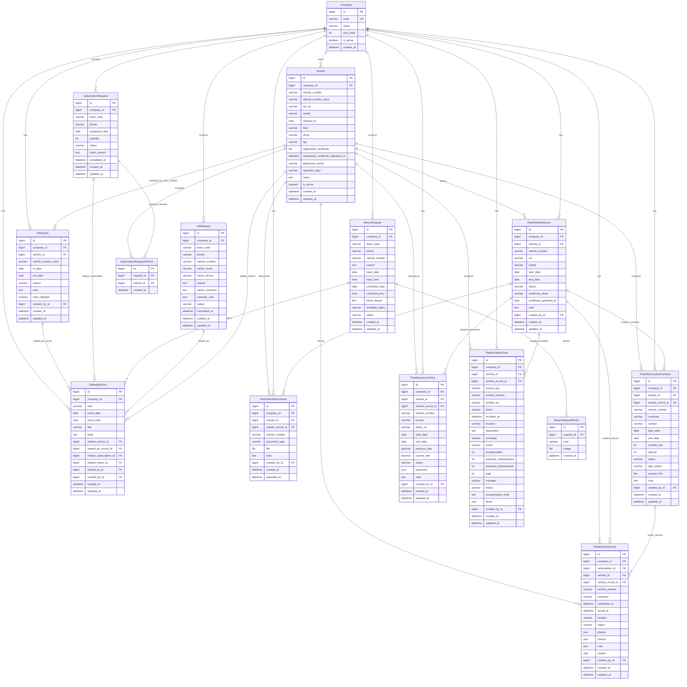

# 차량관리 데이터베이스 ERD

이 문서는 운영 통합관리의 차량관리 도메인을 Vue 프론트엔드와 백엔드 API가 분리된 구조로 관리하기 위한 기준 ERD다.

- Django app: `backend/apps/vehicle_management`
- API prefix: `/api/v1/vehicle/`
- DB table prefix: `vehicle_mgmt_`
- 주의: 기존 현장관리 앱용 요청 테이블과 운영 통합관리 웹용 `fleet_*` 테이블을 함께 사용한다.
- DB 호환성: 로컬 sqlite와 운영 PostgreSQL 모두에서 migration이 가능하도록 별도 PostgreSQL schema 대신 `vehicle_mgmt_*` 테이블명을 사용한다.

## Mermaid ERD

## 화면/API 경계

| Vue 화면 | 주 API | 주요 테이블 |
|---|---|---|
| 차량관리 대시보드 | `GET /vehicle/fleet-site/` | `Vehicle`, `FleetVehicleRecord`, `FleetSubscriptionContract`, `FleetReturnRecord`, `FleetInsurancePolicy`, `FleetAccidentCase`, `FleetVehicleDocument` |
| 차량 목록 | `GET /vehicle/fleet-site/`, `PATCH /vehicle/fleet-records/{id}/status/`, `PATCH /vehicle/vehicles/{id}/status/` | `Vehicle`, `FleetVehicleRecord` |
| 구독 전자계약 | `GET /vehicle/fleet-site/`, `/vehicle/fleet-subscriptions/` | `FleetSubscriptionContract` |
| 반납/수리비 | `GET /vehicle/fleet-site/`, `/vehicle/fleet-returns/` | `FleetReturnRecord` |
| 보험 | `GET /vehicle/fleet-site/`, `/vehicle/fleet-insurances/` | `FleetInsurancePolicy` |
| 사고 관리 | `GET /vehicle/fleet-site/`, `/vehicle/fleet-accidents/` | `FleetAccidentCase` |
| 현장관리 앱 요청 | `/vehicle/subscriptions/`, `/vehicle/returns/`, `/vehicle/as-requests/` | `SubscriptionRequest`, `ReturnRequest`, `ASRequest` |

## 설계 메모

- 운영 웹의 현재 기준 화면은 `fleet_*` 테이블을 중심으로 한다.
- `Vehicle`은 실제 차량 마스터이며, `FleetVehicleRecord`는 대폐차와 차량번호 기준 이력을 보존한다.
- `FleetSiteViewSet`은 여러 테이블을 차량번호별 그룹으로 묶어 Vue 화면에 전달하는 read-model 역할을 한다.
- 정적 `/fleet-management/` HTML은 마이그레이션 기간 동안 fallback으로 유지하되, 신규 진입점은 Vue 라우트 `/portal/vehicle/*`로 둔다.
